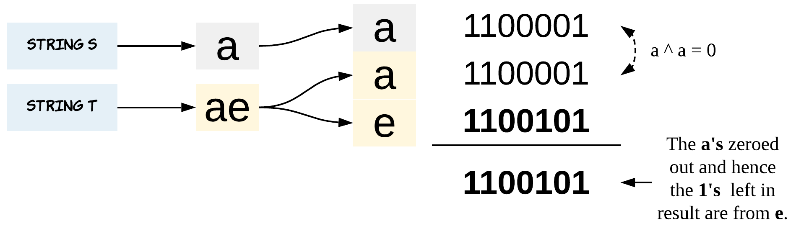

## Approach

Went over with editorial to understand bit manipulation.

`XOR` can be used to zero out the similar pairs. The only remaining bits should be the different character.


- essentially bit makes a character 0/1
- when similars meet 0/0 1/1 `XOR` zeros it out
- so a - a = 0 and ae - a = e

## Code

``` python
class Solution:
    def findTheDifference(self, s: str, t: str) -> str:

        ch = 0
        for char in s:
            ch^= ord(char)

        for char in t:
            ch^=ord(char)

        return chr(ch)
```

## Runtime/Memory

runtime: O(n) n being the length of the strings. the function iterates each string once

memory: O(1) bit is stored as int